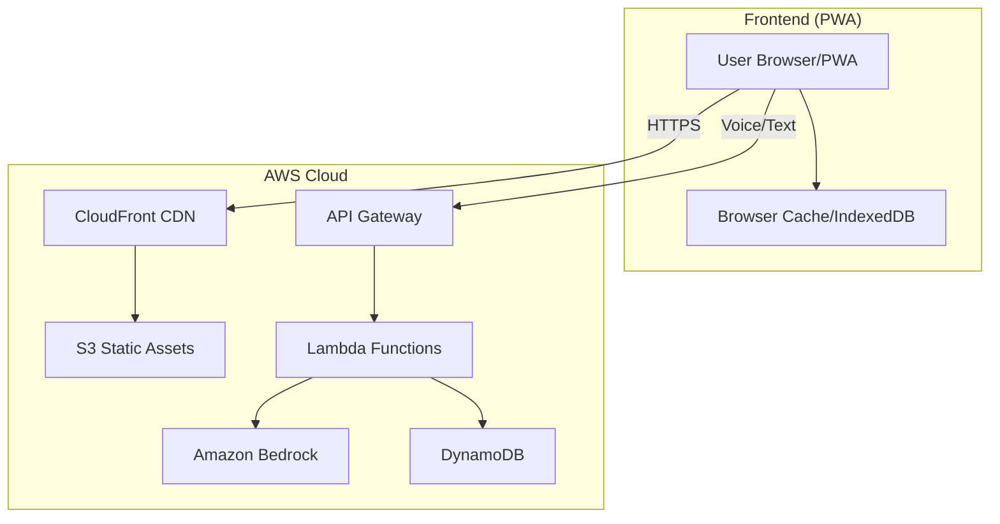
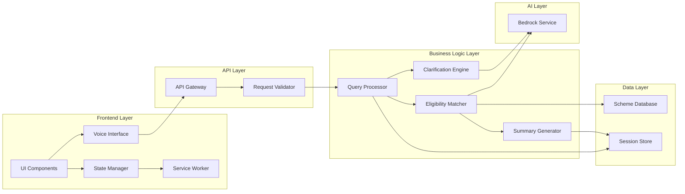
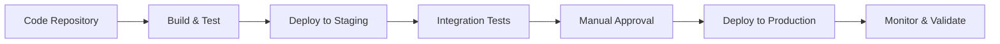

# Design Document: SchemeSahayak

## Overview

SchemeSahayak is a browser-based, voice-first AI assistant that democratizes access to government schemes across India. The system is designed with a mobile-first, progressive web app (PWA) architecture to ensure accessibility on low-end devices and poor network conditions. It leverages Amazon Bedrock's foundation models for natural language understanding, eligibility reasoning, and multi-language support.

The architecture prioritizes:
- **Inclusion**: Voice-first interface with support for Hindi, English, and regional languages
- **Accessibility**: WCAG 2.1 AA compliance, low-bandwidth optimization, offline capabilities
- **Privacy**: Anonymous sessions with no PII collection
- **Scalability**: Serverless architecture supporting nationwide deployment
- **Accuracy**: AI-powered matching with clear disclaimers and official source verification

### Key Technical Decisions

1. **Progressive Web App (PWA)**: Enables offline caching, low-bandwidth operation, and installation on mobile devices without app stores
2. **Amazon Bedrock**: Provides multilingual NLU, dynamic eligibility reasoning, and scheme matching without training custom models
3. **Serverless Architecture**: AWS Lambda + API Gateway for automatic scaling and cost efficiency
4. **Browser-based Speech APIs**: Web Speech API for voice input/output with fallback to cloud services
5. **DynamoDB**: For scheme database and anonymous session storage with automatic TTL
6. **CloudFront + S3**: For global content delivery and static asset caching

## Architecture

### High-Level Architecture



### Component Architecture



## Components and Interfaces

### 1. Frontend Components

#### Voice Interface Component
Handles speech-to-text (STT) and text-to-speech (TTS) operations.

**Interface:**
```typescript
interface VoiceInterface {
  // Start listening for voice input
  startListening(language: string): Promise<void>
  
  // Stop listening and return transcribed text
  stopListening(): Promise<VoiceInput>
  
  // Speak text aloud in specified language
  speak(text: string, language: string): Promise<void>
  
  // Stop current speech
  stopSpeaking(): void
  
  // Check if voice is supported in browser
  isVoiceSupported(): boolean
  
  // Get list of supported languages
  getSupportedLanguages(): Language[]
}

interface VoiceInput {
  text: string
  language: string
  confidence: number
}

interface Language {
  code: string  // e.g., "hi-IN", "en-IN", "mr-IN"
  name: string  // e.g., "Hindi", "English", "Marathi"
}
```

**Implementation Notes:**
- Use Web Speech API (SpeechRecognition, SpeechSynthesis) as primary method
- Fallback to AWS Transcribe/Polly for unsupported browsers or languages
- Cache audio responses in IndexedDB for offline playback
- Support continuous listening mode for conversational interaction

#### State Manager Component
Manages application state including user context, session data, and UI state.

**Interface:**
```typescript
interface StateManager {
  // Initialize or restore session
  initSession(sessionId?: string): Promise<Session>
  
  // Update user context
  updateContext(context: Partial<UserContext>): void
  
  // Get current user context
  getContext(): UserContext
  
  // Save session to backend
  saveSession(): Promise<string>  // Returns session ID
  
  // Clear current session
  clearSession(): void
}

interface Session {
  id: string
  createdAt: Date
  lastUpdated: Date
  context: UserContext
  matchedSchemes: Scheme[]
  conversationHistory: Message[]
}

interface UserContext {
  state?: string
  language: string
  occupation?: string
  ageGroup?: string
  income?: string
  category?: string  // SC/ST/OBC/General
  gender?: string
  hasDisability?: boolean
  additionalInfo: Record<string, any>
}

interface Message {
  role: 'user' | 'assistant'
  content: string
  timestamp: Date
}
```

#### UI Components
React-based components for the user interface.

**Key Components:**
- `LanguageSelector`: Choose interface language
- `StateSelector`: Select user's state/UT
- `VoiceButton`: Trigger voice input
- `ChatInterface`: Display conversation history
- `SchemeCard`: Display matched scheme information
- `SummaryView`: Show shareable summary
- `DisclaimerBanner`: Display responsible AI disclaimers

### 2. Backend Components

#### Query Processor
Processes user input and extracts relevant context.

**Interface:**
```typescript
interface QueryProcessor {
  // Process user query and extract context
  processQuery(input: QueryInput): Promise<QueryResult>
  
  // Update context based on clarification answer
  processAnswer(sessionId: string, answer: boolean, questionId: string): Promise<QueryResult>
}

interface QueryInput {
  text: string
  language: string
  sessionId?: string
  currentContext?: UserContext
}

interface QueryResult {
  extractedContext: Partial<UserContext>
  intent: QueryIntent
  needsClarification: boolean
  clarificationQuestion?: ClarificationQuestion
}

enum QueryIntent {
  FIND_SCHEMES = 'find_schemes',
  GET_DETAILS = 'get_details',
  ANSWER_QUESTION = 'answer_question',
  GENERAL_INQUIRY = 'general_inquiry'
}

interface ClarificationQuestion {
  id: string
  text: string
  contextKey: string
  priority: number
}
```

**Implementation:**
- Use Amazon Bedrock (Claude or Titan) for NLU
- Prompt engineering to extract structured context from natural language
- Support code-mixed input (e.g., "Main ek farmer hoon from UP")
- Maintain conversation context for multi-turn interactions

#### Eligibility Matcher
Matches users with relevant government schemes.

**Interface:**
```typescript
interface EligibilityMatcher {
  // Find matching schemes based on user context
  findMatches(context: UserContext): Promise<MatchResult>
  
  // Get detailed information about a specific scheme
  getSchemeDetails(schemeId: string, language: string): Promise<SchemeDetails>
}

interface MatchResult {
  matches: SchemeMatch[]
  confidence: number
  reasoning: string
}

interface SchemeMatch {
  scheme: Scheme
  relevanceScore: number
  matchedCriteria: string[]
  missingInfo: string[]
}

interface Scheme {
  id: string
  name: Record<string, string>  // Multi-language names
  description: Record<string, string>
  category: string
  level: 'central' | 'state'
  state?: string
  eligibilityCriteria: EligibilityCriteria
  benefits: string[]
  applicationProcess: string[]
  officialLinks: string[]
  iconUrl: string
}

interface EligibilityCriteria {
  minAge?: number
  maxAge?: number
  states?: string[]
  occupations?: string[]
  incomeLimit?: number
  categories?: string[]
  gender?: string[]
  disabilities?: boolean
  customCriteria?: Record<string, any>
}

interface SchemeDetails {
  scheme: Scheme
  simpleExplanation: string
  eligibilityChecklist: string[]
  requiredDocuments: string[]
  applicationSteps: string[]
  faqs: FAQ[]
}

interface FAQ {
  question: string
  answer: string
}
```

**Implementation:**
- Store scheme data in DynamoDB with GSI on state and category
- Use Bedrock for dynamic eligibility reasoning (not just rule-based matching)
- Prompt Bedrock with user context + scheme criteria to determine matches
- Rank schemes by relevance score (combination of criteria match + Bedrock confidence)
- Support fuzzy matching for incomplete information

#### Clarification Engine
Generates progressive yes/no questions to gather missing information.

**Interface:**
```typescript
interface ClarificationEngine {
  // Generate next clarification question
  generateQuestion(context: UserContext, schemes: Scheme[]): Promise<ClarificationQuestion | null>
  
  // Determine if more clarification is needed
  needsMoreInfo(context: UserContext, matches: MatchResult): boolean
}
```

**Implementation:**
- Analyze matched schemes to identify most impactful missing information
- Use Bedrock to generate natural, simple questions in user's language
- Prioritize questions that can significantly narrow down scheme matches
- Limit to 5 questions maximum per session
- Track asked questions to avoid repetition

#### Summary Generator
Creates shareable summaries of matched schemes.

**Interface:**
```typescript
interface SummaryGenerator {
  // Generate summary for session
  generateSummary(sessionId: string): Promise<Summary>
  
  // Get summary by share link
  getSummary(summaryId: string): Promise<Summary>
}

interface Summary {
  id: string
  sessionId: string
  createdAt: Date
  expiresAt: Date
  userContext: UserContext
  matchedSchemes: SchemeMatch[]
  shareUrl: string
}
```

### 3. Data Layer

#### Scheme Database (DynamoDB)
Stores government scheme information.

**Table: Schemes**
- Partition Key: `schemeId` (string)
- Sort Key: None
- GSI 1: `level-state-index` (level as PK, state as SK)
- GSI 2: `category-index` (category as PK)

**Attributes:**
- All fields from `Scheme` interface
- `version`: For scheme updates
- `lastUpdated`: Timestamp
- `isActive`: Boolean flag

#### Session Store (DynamoDB)
Stores anonymous user sessions.

**Table: Sessions**
- Partition Key: `sessionId` (string)
- TTL: `expiresAt` (30 days from creation)

**Attributes:**
- All fields from `Session` interface
- Automatically deleted after 30 days

#### Summary Store (DynamoDB)
Stores shareable summaries.

**Table: Summaries**
- Partition Key: `summaryId` (string)
- TTL: `expiresAt` (90 days from creation)

**Attributes:**
- All fields from `Summary` interface

### 4. AI Integration Layer

#### Bedrock Service Wrapper
Abstracts Amazon Bedrock API calls.

**Interface:**
```typescript
interface BedrockService {
  // Extract context from natural language
  extractContext(text: string, language: string): Promise<Partial<UserContext>>
  
  // Match schemes using AI reasoning
  matchSchemes(context: UserContext, schemes: Scheme[]): Promise<MatchResult>
  
  // Generate clarification question
  generateClarification(context: UserContext, schemes: Scheme[], language: string): Promise<string>
  
  // Generate simple explanation
  generateExplanation(scheme: Scheme, language: string): Promise<string>
  
  // Translate content
  translate(text: string, targetLanguage: string): Promise<string>
}
```

**Implementation:**
- Use Claude 3 (Sonnet or Haiku) for reasoning tasks
- Use Titan Embeddings for semantic search if needed
- Implement prompt templates for each operation
- Handle rate limiting and retries
- Cache common translations in DynamoDB

**Example Prompts:**

*Context Extraction:*
```
You are helping extract structured information from user queries about government schemes in India.

User query: "{user_input}"
Language: {language}

Extract the following information if present:
- State/UT
- Occupation
- Age group
- Income level
- Category (SC/ST/OBC/General)
- Gender
- Disability status
- Any other relevant details

Return as JSON with only the fields you can confidently extract.
```

*Scheme Matching:*
```
You are an expert on Indian government schemes. Determine which schemes this user is eligible for.

User Context:
{context_json}

Available Schemes:
{schemes_json}

For each scheme, determine:
1. Is the user eligible? (yes/no/maybe)
2. Relevance score (0-100)
3. Which criteria match
4. What information is missing

Return as JSON array of matches.
```

## Data Models

### Scheme Data Structure
Schemes are stored with multi-language support and structured eligibility criteria.

**Example Scheme (PM-KISAN):**
```json
{
  "schemeId": "pm-kisan-2024",
  "name": {
    "en": "PM-KISAN (Pradhan Mantri Kisan Samman Nidhi)",
    "hi": "पीएम-किसान (प्रधानमंत्री किसान सम्मान निधि)",
    "mr": "पीएम-किसान (प्रधानमंत्री किसान सम्मान निधी)"
  },
  "description": {
    "en": "Income support to all farmer families",
    "hi": "सभी किसान परिवारों को आय सहायता",
    "mr": "सर्व शेतकरी कुटुंबांना उत्पन्न आधार"
  },
  "category": "agriculture",
  "level": "central",
  "eligibilityCriteria": {
    "occupations": ["farmer", "agriculture"],
    "landOwnership": "required",
    "customCriteria": {
      "landSize": "any",
      "excludes": ["institutional_landholders", "government_employees"]
    }
  },
  "benefits": [
    "₹6000 per year in three installments",
    "Direct bank transfer"
  ],
  "applicationProcess": [
    "Visit PM-KISAN portal or CSC",
    "Provide Aadhaar number",
    "Submit land records",
    "Link bank account"
  ],
  "officialLinks": [
    "https://pmkisan.gov.in"
  ],
  "iconUrl": "/icons/pm-kisan.svg",
  "isActive": true,
  "version": 1,
  "lastUpdated": "2024-01-15T00:00:00Z"
}
```

### Session Data Structure
Sessions maintain conversation state without PII.

**Example Session:**
```json
{
  "sessionId": "sess_abc123xyz",
  "createdAt": "2024-01-20T10:30:00Z",
  "lastUpdated": "2024-01-20T10:35:00Z",
  "expiresAt": "2024-02-19T10:30:00Z",
  "context": {
    "state": "Maharashtra",
    "language": "hi",
    "occupation": "farmer",
    "ageGroup": "35-50",
    "additionalInfo": {
      "hasLand": true,
      "landSize": "2_acres"
    }
  },
  "matchedSchemes": [
    {
      "schemeId": "pm-kisan-2024",
      "relevanceScore": 95,
      "matchedCriteria": ["occupation", "state"]
    }
  ],
  "conversationHistory": [
    {
      "role": "user",
      "content": "Main Maharashtra ka kisaan hoon",
      "timestamp": "2024-01-20T10:30:00Z"
    },
    {
      "role": "assistant",
      "content": "Aapke liye kuch yojanayen hain...",
      "timestamp": "2024-01-20T10:30:15Z"
    }
  ]
}
```

## Error Handling

### Error Categories

1. **Voice Input Errors**
   - Microphone permission denied → Show text input alternative
   - Speech recognition failure → Retry with user prompt, fallback to text
   - Unsupported language → Offer closest supported language

2. **Network Errors**
   - API timeout → Retry with exponential backoff (3 attempts)
   - Offline mode → Serve cached data, queue requests for later
   - Rate limiting → Show user-friendly message, implement client-side throttling

3. **AI Service Errors**
   - Bedrock throttling → Implement request queuing and retry logic
   - Invalid response → Fallback to rule-based matching
   - Context extraction failure → Ask explicit clarification questions

4. **Data Errors**
   - Scheme not found → Log error, show generic message
   - Session expired → Create new session, inform user
   - Invalid state selection → Prompt user to reselect

### Error Response Format

```typescript
interface ErrorResponse {
  code: string
  message: string
  userMessage: Record<string, string>  // Multi-language
  retryable: boolean
  fallbackAction?: string
}
```

### Graceful Degradation

- **No voice support** → Text-only mode with clear instructions
- **No Bedrock** → Rule-based matching with reduced accuracy disclaimer
- **No internet** → Offline mode with cached schemes and disclaimer
- **Slow connection** → Progressive loading, show cached results first

## Testing Strategy

### Unit Testing
- Test individual components in isolation
- Mock external dependencies (Bedrock, DynamoDB, Speech APIs)
- Focus on:
  - Context extraction logic
  - Eligibility rule evaluation
  - Session management
  - Error handling paths
  - Multi-language text processing

### Property-Based Testing
- Verify universal properties across randomized inputs
- Test with property-based testing library (fast-check for TypeScript)
- Each test runs minimum 100 iterations
- Properties reference design document and requirements

### Integration Testing
- Test component interactions
- Use LocalStack for AWS service mocking
- Test scenarios:
  - End-to-end user flows
  - Voice input → scheme matching → summary generation
  - Session persistence and restoration
  - Offline-to-online synchronization

### Accessibility Testing
- Automated: axe-core, Lighthouse accessibility audits
- Manual: Screen reader testing (NVDA, JAWS, VoiceOver)
- Keyboard navigation testing
- Color contrast verification

### Performance Testing
- Load testing with Artillery or k6
- Target: 10,000 concurrent users
- Monitor: Response times, error rates, Bedrock throttling
- Test low-bandwidth scenarios with network throttling

### Localization Testing
- Verify translations for all supported languages
- Test RTL languages if added
- Verify voice input/output for each language
- Cultural appropriateness review


## Correctness Properties

A property is a characteristic or behavior that should hold true across all valid executions of a system—essentially, a formal statement about what the system should do. Properties serve as the bridge between human-readable specifications and machine-verifiable correctness guarantees.

### Input Processing Properties

**Property 1: Multi-language voice transcription**
*For any* audio input in a supported language (Hindi, English, regional languages), the Voice_Interface should successfully transcribe it to text and correctly identify the source language.
**Validates: Requirements 1.1**

**Property 2: Multi-language text acceptance**
*For any* text input in a supported language, the Query_Processor should accept and process it without errors.
**Validates: Requirements 1.2**

**Property 3: Context extraction from natural language**
*For any* user input containing contextual information (state, occupation, age, etc.), the Query_Processor should extract all explicitly mentioned context fields correctly.
**Validates: Requirements 1.4, 2.2**

### State Management Properties

**Property 4: Session state persistence**
*For any* session with set State_Context, the context should remain unchanged throughout all operations until explicitly modified by the user.
**Validates: Requirements 2.3**

**Property 5: State change triggers re-evaluation**
*For any* session where the user changes their state selection, the system should update the State_Context and invoke the Eligibility_Matcher to re-evaluate scheme matches.
**Validates: Requirements 2.4**

### Eligibility Matching Properties

**Property 6: Bedrock invocation with complete context**
*For any* user context provided to the Eligibility_Matcher, the system should invoke Bedrock_Service with both the user context and the complete scheme database.
**Validates: Requirements 3.1**

**Property 7: State-specific scheme inclusion**
*For any* user context with a specified state, the Eligibility_Matcher should include both central schemes and schemes specific to that state in the evaluation set.
**Validates: Requirements 3.3**

**Property 8: Relevance-based ranking**
*For any* set of matched schemes returned by Bedrock_Service, the system should sort them in descending order by relevance score before presenting to the user.
**Validates: Requirements 3.4**

**Property 9: Clarification before no-match conclusion**
*For any* user context that initially yields no scheme matches, the system should generate at least one clarifying question before concluding that no schemes are available.
**Validates: Requirements 3.5**

### Clarification Properties

**Property 10: Question generation for incomplete context**
*For any* user context with missing information that could affect scheme eligibility, the Clarification_Engine should generate a yes/no question to gather the missing information.
**Validates: Requirements 4.1**

**Property 11: High-priority gaps addressed first**
*For any* user context with multiple information gaps, the first clarifying question should address the gap with the highest priority score (most impactful for matching).
**Validates: Requirements 4.2**

**Property 12: Answer updates context and re-evaluates**
*For any* clarifying question answered by the user, the system should update the user context with the answer and re-invoke the Eligibility_Matcher.
**Validates: Requirements 4.3**

**Property 13: Maximum five clarifying questions**
*For any* session, the Clarification_Engine should generate no more than 5 clarifying questions, regardless of how many information gaps exist.
**Validates: Requirements 4.4**

### Content Presentation Properties

**Property 14: Output language matches user selection**
*For any* system-generated content (explanations, TTS output), the language should match the user's selected language preference.
**Validates: Requirements 5.1, 12.2**

**Property 15: Scheme details completeness**
*For any* scheme displayed to the user, the details should include benefits, eligibility criteria, application steps, and official links (when available).
**Validates: Requirements 5.2, 5.3**

**Property 16: Visual icons in displays**
*For any* scheme or summary displayed to the user, the output should include visual icon references for enhanced comprehension.
**Validates: Requirements 5.4, 8.5**

**Property 17: Sectioned information presentation**
*For any* scheme explanation or description, the text should be divided into sections with no single section exceeding 200 characters.
**Validates: Requirements 5.5**

### Offline and Caching Properties

**Property 18: Low-bandwidth mode activation**
*For any* network condition where connection speed falls below 100 kbps, the system should automatically enable Low_Bandwidth_Mode.
**Validates: Requirements 6.1**

**Property 19: Data compression in low-bandwidth mode**
*For any* API response in Low_Bandwidth_Mode, the data transfer size should be at least 40% smaller than the same response in normal mode.
**Validates: Requirements 6.2**

**Property 20: Scheme caching round-trip**
*For any* scheme information retrieved while online, the data should be cached locally such that it remains accessible when the system goes offline.
**Validates: Requirements 6.3, 6.4**

**Property 21: Offline-to-online synchronization**
*For any* operations queued while offline, when connectivity is restored, all queued operations should execute in the order they were queued.
**Validates: Requirements 6.5**

### Session Management Properties

**Property 22: Unique session creation**
*For any* new user interaction, the system should create a session with a unique identifier that doesn't collide with any existing session ID.
**Validates: Requirements 7.1**

**Property 23: PII-free session storage**
*For any* session data stored in the database, the data should contain no personally identifiable information (name, phone, email, Aadhaar, address).
**Validates: Requirements 7.2**

**Property 24: Session restoration round-trip**
*For any* session that is saved and later restored using its session ID, the restored context and matched schemes should be equivalent to the original session state.
**Validates: Requirements 7.3**

### Summary Properties

**Property 25: Summary completeness**
*For any* generated summary, it should include all matched schemes with their names, descriptions, eligibility criteria, and application links.
**Validates: Requirements 8.1, 8.4**

**Property 26: Unauthenticated summary access**
*For any* summary generated with a shareable link, accessing that link should return the summary content without requiring authentication or login.
**Validates: Requirements 8.2**

**Property 27: Summary retrieval consistency**
*For any* summary accessed via its shareable link, the displayed content should match the original summary data that was generated.
**Validates: Requirements 8.3**

### Accessibility Properties

**Property 28: ARIA labels presence**
*For any* interactive UI element, the rendered HTML should include appropriate ARIA labels or semantic HTML tags for screen reader compatibility.
**Validates: Requirements 9.2**

**Property 29: Keyboard navigation completeness**
*For any* interactive element in the UI, it should be reachable and operable using only keyboard inputs (Tab, Enter, Space, Arrow keys).
**Validates: Requirements 9.3**

**Property 30: Text alternatives for visual content**
*For any* image or icon displayed in the UI, the HTML should include a text alternative (alt attribute or aria-label).
**Validates: Requirements 9.4**

**Property 31: Color contrast compliance**
*For any* text displayed in the UI, the color contrast ratio between text and background should meet or exceed WCAG 2.1 AA standards (4.5:1 for normal text, 3:1 for large text).
**Validates: Requirements 9.5**

### Transparency Properties

**Property 32: Verification notice in results**
*For any* scheme match displayed to the user, the output should include a notice advising verification with official sources.
**Validates: Requirements 10.2**

**Property 33: Uncertainty communication**
*For any* eligibility determination where Bedrock_Service returns a confidence score below 70%, the system should explicitly state the uncertainty in the response.
**Validates: Requirements 10.3**

**Property 34: AI content disclaimer**
*For any* content generated by Bedrock_Service, the display should include a disclaimer indicating it is AI-generated and not official government communication.
**Validates: Requirements 10.5**

### Voice Output Properties

**Property 35: TTS option availability**
*For any* text response generated by the system, the UI should provide a control to trigger text-to-speech playback.
**Validates: Requirements 12.1**

**Property 36: Audio control functionality**
*For any* active TTS playback, the user should be able to pause, replay, and skip the audio using provided controls.
**Validates: Requirements 12.4**

**Property 37: Audio optimization in low-bandwidth mode**
*For any* TTS audio generated in Low_Bandwidth_Mode, the audio file size should be at least 30% smaller than the same audio in normal mode while maintaining intelligibility.
**Validates: Requirements 12.5**


## API Specifications

### REST API Endpoints

#### POST /api/query
Process user query and return matched schemes.

**Request:**
```json
{
  "text": "Main Maharashtra ka kisaan hoon",
  "language": "hi",
  "sessionId": "sess_abc123" // optional
}
```

**Response:**
```json
{
  "sessionId": "sess_abc123",
  "extractedContext": {
    "state": "Maharashtra",
    "occupation": "farmer",
    "language": "hi"
  },
  "matches": [
    {
      "schemeId": "pm-kisan-2024",
      "name": "PM-KISAN",
      "relevanceScore": 95,
      "briefDescription": "किसानों के लिए आय सहायता"
    }
  ],
  "needsClarification": false,
  "clarificationQuestion": null
}
```

#### POST /api/clarify
Answer a clarification question.

**Request:**
```json
{
  "sessionId": "sess_abc123",
  "questionId": "q_land_ownership",
  "answer": true
}
```

**Response:**
```json
{
  "sessionId": "sess_abc123",
  "updatedContext": {
    "state": "Maharashtra",
    "occupation": "farmer",
    "hasLand": true
  },
  "matches": [...],
  "needsClarification": false
}
```

#### GET /api/scheme/{schemeId}
Get detailed information about a specific scheme.

**Query Parameters:**
- `language`: Language code (e.g., "hi", "en")

**Response:**
```json
{
  "scheme": {
    "id": "pm-kisan-2024",
    "name": "PM-KISAN",
    "description": "...",
    "benefits": [...],
    "eligibility": [...],
    "applicationSteps": [...],
    "officialLinks": [...],
    "iconUrl": "/icons/pm-kisan.svg"
  },
  "simpleExplanation": "यह योजना किसानों को...",
  "faqs": [...]
}
```

#### POST /api/session/save
Save current session for later retrieval.

**Request:**
```json
{
  "sessionId": "sess_abc123"
}
```

**Response:**
```json
{
  "sessionId": "sess_abc123",
  "expiresAt": "2024-02-19T10:30:00Z"
}
```

#### GET /api/session/{sessionId}
Restore a saved session.

**Response:**
```json
{
  "session": {
    "id": "sess_abc123",
    "context": {...},
    "matchedSchemes": [...],
    "conversationHistory": [...]
  }
}
```

#### POST /api/summary/generate
Generate a shareable summary.

**Request:**
```json
{
  "sessionId": "sess_abc123"
}
```

**Response:**
```json
{
  "summaryId": "sum_xyz789",
  "shareUrl": "https://schemesahayak.gov.in/summary/sum_xyz789",
  "expiresAt": "2024-04-19T10:30:00Z"
}
```

#### GET /api/summary/{summaryId}
Retrieve a shareable summary.

**Response:**
```json
{
  "summary": {
    "id": "sum_xyz789",
    "createdAt": "2024-01-20T10:35:00Z",
    "userContext": {...},
    "matchedSchemes": [...],
    "nextSteps": [...]
  }
}
```

### WebSocket API (Optional Enhancement)

For real-time conversational interaction:

**Connection:** `wss://api.schemesahayak.gov.in/ws`

**Messages:**
```json
// Client -> Server
{
  "type": "query",
  "text": "...",
  "language": "hi"
}

// Server -> Client
{
  "type": "response",
  "matches": [...],
  "needsClarification": false
}

// Client -> Server
{
  "type": "voice_chunk",
  "audio": "base64_encoded_audio",
  "isLast": false
}

// Server -> Client
{
  "type": "transcription",
  "text": "...",
  "language": "hi"
}
```

## Security Considerations

### Data Privacy
- **No PII Collection**: System never requests or stores name, phone, email, Aadhaar, or address
- **Anonymous Sessions**: Session IDs are randomly generated UUIDs with no user linkage
- **Automatic Expiry**: Sessions expire after 30 days, summaries after 90 days
- **No Tracking**: No cookies or tracking pixels beyond essential session management

### API Security
- **Rate Limiting**: 100 requests per IP per minute to prevent abuse
- **Input Validation**: All user inputs sanitized to prevent injection attacks
- **HTTPS Only**: All API endpoints require TLS 1.2 or higher
- **CORS Policy**: Restrict API access to approved domains
- **API Gateway Throttling**: Protect backend services from overload

### Content Security
- **CSP Headers**: Strict Content Security Policy to prevent XSS
- **Input Sanitization**: All user text inputs sanitized before processing
- **Output Encoding**: All dynamic content properly encoded
- **Bedrock Guardrails**: Use Amazon Bedrock guardrails to filter harmful content

### Infrastructure Security
- **IAM Roles**: Least-privilege access for all AWS services
- **VPC Isolation**: Backend services in private subnets
- **Encryption**: Data encrypted at rest (DynamoDB, S3) and in transit (TLS)
- **WAF Rules**: AWS WAF to block common attack patterns
- **CloudWatch Monitoring**: Real-time monitoring for security events

## Deployment Architecture

### AWS Services Used

1. **Frontend Hosting**
   - S3: Static assets (HTML, CSS, JS, icons)
   - CloudFront: Global CDN with edge caching
   - Route 53: DNS management

2. **API Layer**
   - API Gateway: REST API endpoints with throttling
   - Lambda: Serverless compute for business logic
   - Lambda@Edge: Request/response manipulation at edge

3. **AI Services**
   - Amazon Bedrock: Foundation models (Claude 3, Titan)
   - Amazon Transcribe: Fallback for voice input
   - Amazon Polly: Fallback for voice output

4. **Data Storage**
   - DynamoDB: Schemes, sessions, summaries
   - S3: Audio caches, static content
   - ElastiCache: Optional Redis for hot data

5. **Monitoring & Logging**
   - CloudWatch: Logs, metrics, alarms
   - X-Ray: Distributed tracing
   - CloudWatch RUM: Real user monitoring

### Deployment Regions

**Primary Region**: ap-south-1 (Mumbai)
- Lowest latency for Indian users
- Bedrock availability
- Full service coverage

**DR Region**: ap-southeast-1 (Singapore)
- Failover capability
- Cross-region DynamoDB replication

### CI/CD Pipeline



**Pipeline Stages:**
1. **Build**: Compile TypeScript, bundle frontend, run unit tests
2. **Test**: Run property-based tests, integration tests, accessibility tests
3. **Staging**: Deploy to staging environment, run smoke tests
4. **Approval**: Manual review of staging deployment
5. **Production**: Blue-green deployment to production
6. **Validation**: Monitor metrics, rollback if issues detected

### Scaling Strategy

**Frontend:**
- CloudFront automatically scales globally
- S3 handles unlimited requests
- Service Worker caching reduces origin requests

**API Layer:**
- Lambda auto-scales to 10,000 concurrent executions
- API Gateway handles millions of requests per second
- Reserved concurrency for critical functions

**Data Layer:**
- DynamoDB on-demand scaling
- DAX (DynamoDB Accelerator) for read-heavy workloads
- Global tables for multi-region access

**AI Layer:**
- Bedrock handles scaling automatically
- Request queuing for throttle management
- Fallback to cached responses during high load

## Monitoring and Observability

### Key Metrics

**User Experience:**
- Time to first response (target: <3s)
- Voice transcription accuracy (target: >90%)
- Scheme match relevance (user feedback)
- Session completion rate

**System Performance:**
- API response times (p50, p95, p99)
- Lambda cold start frequency
- Bedrock request latency
- Cache hit rates

**Business Metrics:**
- Daily active users
- Queries per user
- Most searched schemes
- State-wise usage distribution
- Language preference distribution

**Error Rates:**
- API error rate (target: <1%)
- Voice input failures
- Bedrock throttling events
- Session restoration failures

### Alerting

**Critical Alerts:**
- API error rate >5% for 5 minutes
- Average response time >10s for 5 minutes
- Bedrock throttling >100 requests/minute
- DynamoDB throttling events

**Warning Alerts:**
- API error rate >2% for 10 minutes
- Cache hit rate <70%
- Lambda cold starts >20% of invocations
- Session restoration failures >5%

### Logging Strategy

**Application Logs:**
- Structured JSON logging
- Request ID tracking across services
- User context (anonymized) in logs
- Error stack traces with context

**Audit Logs:**
- All scheme database updates
- Configuration changes
- Access to sensitive operations

**Performance Logs:**
- Bedrock request/response times
- Database query performance
- Cache operations

## Cost Optimization

### Estimated Monthly Costs (10,000 DAU)

**Assumptions:**
- 10,000 daily active users
- 3 queries per user per day
- 30,000 queries/day = 900,000 queries/month

**Cost Breakdown:**

1. **API Gateway**: $3.50/million requests = $3.15
2. **Lambda**: 
   - 900K invocations × 2s avg × 512MB = $7.20
3. **Bedrock**:
   - 900K requests × 1000 tokens avg = 900M tokens
   - Claude 3 Haiku: ~$0.25/M input + $1.25/M output = $1,350
4. **DynamoDB**:
   - On-demand: ~$25 for reads/writes
5. **CloudFront**: 
   - 10GB data transfer = $1.00
6. **S3**: 
   - Storage + requests = $2.00
7. **Other** (CloudWatch, X-Ray): $10

**Total: ~$1,400/month for 10,000 DAU**

**Cost per user per month: $0.14**

### Optimization Strategies

1. **Caching**: Aggressive caching reduces Bedrock calls by 40%
2. **Lambda Optimization**: Right-size memory, reduce cold starts
3. **DynamoDB**: Use on-demand for variable traffic
4. **Bedrock**: Use Haiku model for simple tasks, Sonnet for complex reasoning
5. **CloudFront**: Maximize cache hit ratio with proper headers

## Future Enhancements

### Phase 2 Features
- **More Languages**: Add support for Tamil, Telugu, Bengali, Gujarati, Kannada
- **Document Upload**: Allow users to upload documents for automatic eligibility extraction
- **Application Tracking**: Track application status for schemes
- **Notifications**: SMS/WhatsApp notifications for scheme deadlines
- **Chatbot Integration**: WhatsApp/Telegram bot interface

### Phase 3 Features
- **Personalized Recommendations**: ML-based scheme recommendations
- **Community Features**: User reviews and success stories
- **Video Guides**: Step-by-step video tutorials for applications
- **Agent Assistance**: Connect users with government agents for help
- **Mobile Apps**: Native iOS/Android apps for better offline support

### Technical Improvements
- **GraphQL API**: More flexible data fetching
- **Real-time Updates**: WebSocket for live scheme updates
- **Advanced Caching**: Redis for hot data, CDN for API responses
- **A/B Testing**: Experiment framework for UX improvements
- **Analytics**: Detailed usage analytics and insights
